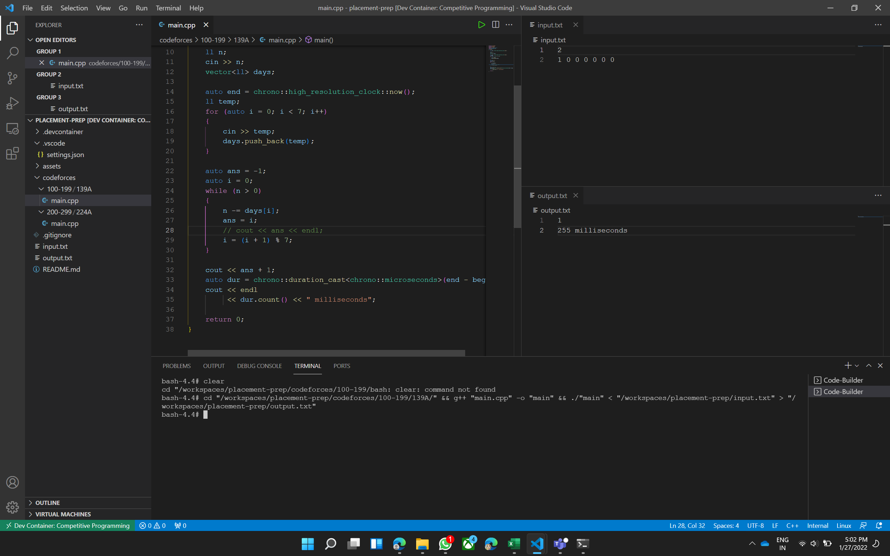

# My Placement Prep Setup

## Why This Setup is Kinda Cool

- Devcontainer support which comes with cpp, java and nodejs, python preinstalled.
- Pre-installed VS-Code extensions which build and run code using the supplied input and output files with one keybinding.
- Gitignored artifacts for popular languages.

## Window Layout

You can use this window layout to get a good overview of your input and output.

Hit <b>Ctrl+Alt+K</b> to run the code with the set input and output files. This saves time and doesn't require you to manually enter input each time.
